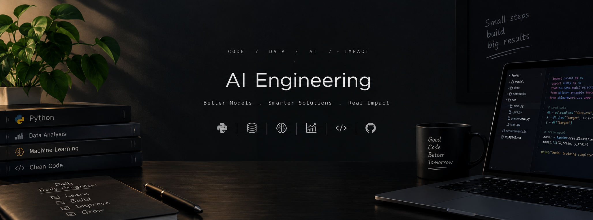

<div align="center">


<a href="https://git.io/typing-svg">
  
</a>

<br/>


<br/>


</div>

<br/>

## 👩‍💻 Who I Am

```typescript
const mehreen = {
  title: "Computer Science Student | Aspiring Data Analyst & AI/ML Engineer",
  stack: {
    languages: ["Python", "C++", "SQL", "JavaScript", "TypeScript"],
    frontend: ["React", "Next.js", "HTML", "CSS", "Tailwind CSS"],
    backend: ["Node.js", "Express.js", "FastAPI"],
    database: ["MySQL", "MongoDB", "Prisma ORM"],
    dataAndAI: ["Pandas", "NumPy", "Scikit-learn", "Matplotlib", "Power BI", "Machine Learning"],
    tools: ["Git", "GitHub", "VS Code", "Jupyter Notebook", "Google Colab", "Postman", "Vercel"]
  },
  launchedProjects: ["PersonaPortfolio Builder"],
  certifications: [],
  status: "Building AI-powered tools & sharpening my data analytics skills",
  openTo: "Full-time roles, internships & collaborations in Data Analytics / AI-ML"
};
```

<br/>

## 🚀 Featured Projects

### 🧩 PersonaPortfolio Builder

AI-powered portfolio builder that enables users to create, customize, and publish professional portfolios with authentication, resume uploads, analytics, and AI-generated bios.

<div align="left">
  
</div>

| Layer      | Technology                          |
|------------|--------------------------------------|
| Frontend   | React, Next.js, Tailwind CSS         |
| Backend    | Node.js, Express.js                  |
| Database   | MongoDB, Prisma ORM                  |
| AI         | AI-generated bios                    |
| Deployment | Vercel                               |

🔗 [Live Demo](https://prf-builder.vercel.app/portfolio/mehreen) &nbsp;|&nbsp; 💻 [Source Code](https://github.com/18-mehreen/portfolio_ai)

<br/>

## 🛠️ Tech Stack

**Languages**


**Frontend**


**Backend**


**Database**


**Data & AI**


**Dev Tools**


<br/>

## 📊 GitHub Stats

<div align="center">
  
  
</div>

<div align="center">
  
</div>

<br/>

## 🏆 GitHub Trophies

<div align="center">
  
</div>

<br/>

## 📈 Contribution Activity

<div align="center">
  
</div>

<br/>

## 🤝 Connect With Me

<div align="center">

[](https://www.linkedin.com/in/mehreen-yaqoob-876a93368)
[](mailto:yaqmehr18@gmail.com)

</div>

<br/>


